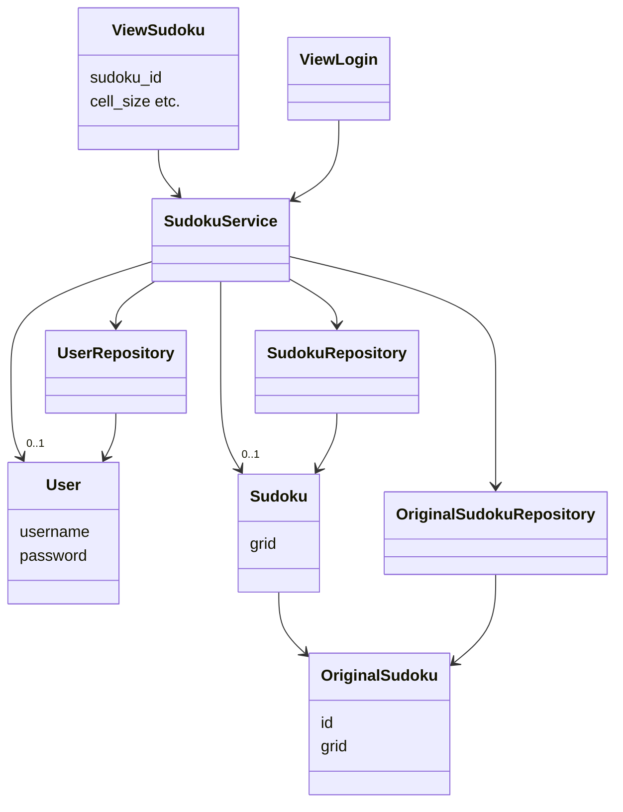

```mermaid
 classDiagram
      class User{
          username
          password
      }
      class Sudoku{
          grid
      }
      class OriginalSudoku{
          id
          grid
      }
      class SudokuService{
      }
      class ViewSudoku{
          sudoku_id
          cell_size etc.
      }
      class ViewLogin{
      }
      class UserRepository{
      }
      class SudokuRepository{
      }
      ViewSudoku --> SudokuService
      ViewLogin --> SudokuService
      SudokuService --> "0..1" User
      SudokuService --> "0..1" Sudoku
      SudokuService --> UserRepository
      UserRepository --> User
      SudokuService --> SudokuRepository
      SudokuRepository --> Sudoku
      Sudoku --> OriginalSudoku
      OriginalSudokuRepository --> OriginalSudoku
      SudokuService --> OriginalSudokuRepository
```
