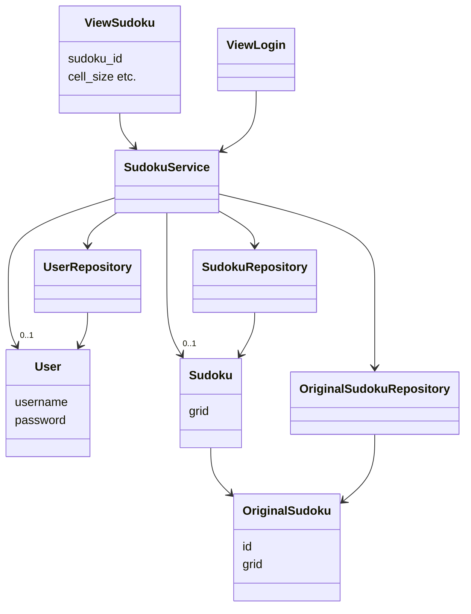
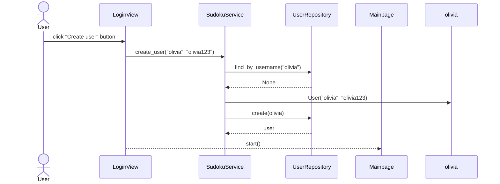

# Arkkitehtuurikuvaus

## Rakenne

Sovelluksen rakenne mukailee kurssin referenssisovelluksen [TodoApp](https://github.com/ohjelmistotekniikka-hy/python-todo-app) kolmitasoista kerrosarkkitehtuuria, ja sisältää seuraavat pakkaukset/kansiot.

- **ui** sisältää käyttöliittymään liittyvän koodin
- **services** sisältää sovelluslogiikkaan liittyvät koodin
- **repositories** sisältää sovelluksen tarvitseman pysyväistallennukseen liittyvän koodin
- **entities** sisältää sovelluksen tietokohteisiin liittyvän koodin

Nämä paketit sisältävät seuraavassa luokkakaaviossa esitetyt luokat.

### Luokkakaavio sovelluksesta

Oheinenkaavio kuvastaa sovelluksen luokkien suhdetta toisiinsa.



## Käyttöliittymä

Käyttöliittymä sisältää kolme erilaista näkymää:

- Kirjautuminen/uuden käyttäjän luominen
- Etusivu jossa lista sudokuista
- Sudokun pelinäkymä

Käyttäjän käyttöliittymässä antaman syötteen huomioimisesta ja näkymien vaihtamisesta huolehtii GameLoop -luokka. Näkymän päivittämisestä huolehtii Renderer -luokka, jota kutsutaan joka kierroksella. Kaikki käyttöliittymän koodi huolehtii vain käyttöliittymän päivittämisestä ja kutsuu SudokuService -luokan metodeja, joka huolehtii itse sovelluslogiikasta.

Kirjautumisesta ja uuden käyttäjän luomisesta vastaavan näkymän piirtämisestä huolehtii LoginView -luokka.
Etusivun piirtämisestä huolehtii ViewMainpage -luokka.
Sudokun pelinäkymän piirtämisestä huolehtii ViewSudoku -luokka.
Kaikki luokat on sijoitettu omiin ui -kansiosta löytyviin moduuleihinsa.

## Sovelluslogiikka

Sovelluslogiikasta vastaa SudokuService -luokan ainoa olio. Luokka huolehtii sovelluslogiikasta käyttäjän käyttöliittymässä antaman syötteen mukaisesti.

Sovellus sisältää kolmenlaisia tietokohteita, jotka kaikki on toteutettu omina luokkinaan:
- **User** -luokka kuvaa käyttäjään liittyviä tietoja.
- **OriginalSudoku** -luokka kuvaa alkuperäisiä sovellukseen lisättyjä sudokuita, joita ei voi muokata.
- **Sudoku** -luokka kuvaa käyttäjän henkilökohtaisia muokattuja sudokuita, jotka liittyvät aina tiettyyn OriginalSudoku -luokan olioon.

SudokuService käsittelee sudokuihin ja käyttäjiin liittyviä tietoja repositories -pakkauksessa sijaitsevien luokkien OriginalSudokuRepository, SudokuRepository ja UserRepository avulla.

Seuraava esimerkki kuvaa sovelluslogiikkaa käyttäjän kirjautuessa sovellukseen:

### Sekvenssikaavio uuden käyttäjän luomisesta

Kun uusi käyttäjä kirjautuu sovellukseen, kontrolli etenee seuraavasti:


## Tietojen pysyväistallennus

Pakkausen repositories luokat UserRepository, OriginalSudokuRepository ja SudokuRepository huolehtivat tietojen tallettamisesta pysyväismuistiin. UserRepository tallentaa tietoa SQLite -tietokantaan. Sudokuihin liittyvät repositoriot tallentavat tietoa csv -tiedoistoihin.

### Pysyväistallennukseen liittyvät tiedostot

Sovelluksen juureen sijoitettu konfiguraatiotiedosto määrittelee tiedostojen nimet, joihin tieto tallennetaan. Käyttäjä voi halutessaan muuttaa näitä nimiä.

Käyttäjät tallennetaan SQLite tietokannan tauluun users. Tietokanta alustetaan initialize_database.py moduulissa.

Alkuperäiset sudokut talletetaan csv -tiedostoon seuraavassa muodossa:

```
1;7, 8, 0, 4, 0, 0, 1, 2, 0;6, 0, 0, 0, 7, 5, 0, 0, 9;0, 0, 0, 6, 0, 1, 0, 7, 8;0, 0, 7, 0, 4, 0, 2, 6, 0;0, 0, 1, 0, 5, 0, 9, 3, 0;9, 0, 4, 0, 6, 0, 0, 0, 5;0, 7, 0, 3, 0, 0, 0, 1, 2;1, 2, 0, 0, 0, 7, 4, 0, 0;0, 4, 9, 2, 0, 6, 0, 0, 7
```
Ensimmäinen kenttä on kyseisen alkuperäisen sudokun id, jonka perusteella alkuperäiset numerot haetaan myöhemmin käyttäjän aloittaessa peliä. Seuraavat kentät sisältävät alkuperäiset numerot riveittäin eli kenttiä on yhteensä 9, joissa jokaisessa on 9 numeroa.

Käyttäjän muokkaamat sudokut talletetaan csv -tiedostoon seuraavassa muodossa:

```
1;olivia;0, 0, 0, 0, 0, 0, 0, 0, 0;0, 0, 4, 0, 0, 0, 0, 0, 0;0, 0, 0, 0, 0, 0, 0, 0, 0;0, 0, 0, 0, 0, 0, 0, 0, 0;0, 0, 0, 0, 0, 0, 0, 0, 0;0, 0, 0, 0, 0, 0, 0, 0, 0;0, 0, 0, 0, 0, 0, 0, 0, 0;0, 0, 0, 0, 0, 0, 0, 0, 0;0, 0, 0, 0, 0, 0, 0, 0, 0
```
Ensimmäinen kenttä on kyseiseen keskeneräiseen ratkaisuun liittyvät numerot. Seuraavissa kentissä on käyttäjän lisäämät numerot riveittäin. Jos käyttäjä ei ole lisännyt mitään numeroa, numeron kohdalla on 0 eli myös alkuperäisten numeroiden kohdalla on 0. Jos käyttäjä on lisännyt numeron, kyseisen numeron kohdalla on lisätty numero.
