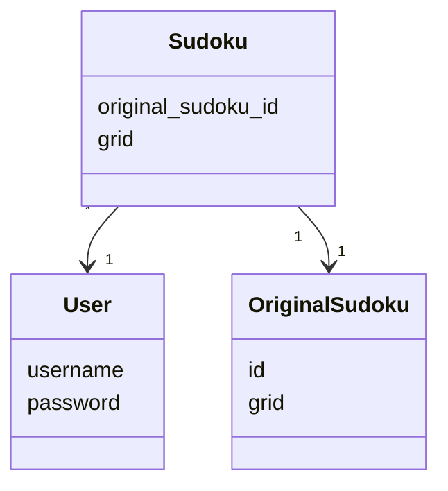
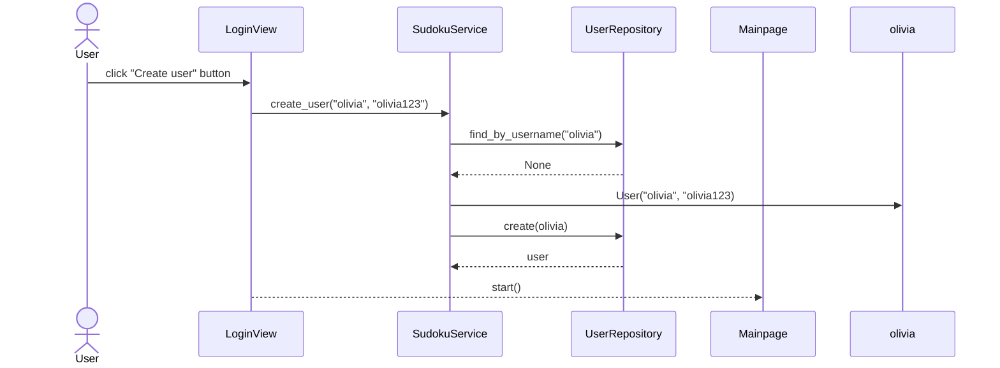

# Arkkitehtuurikuvaus

## Rakenne

Sovelluksen rakenne mukailee kurssin referenssisovelluksen [TodoApp](https://github.com/ohjelmistotekniikka-hy/python-todo-app) kolmitasoista kerrosarkkitehtuuria, ja sisältää seuraavat pakkaukset/kansiot.

- [**ui**](https://github.com/oliviahorjamo/OhTe-harjoitustyo-2022/tree/master/src/ui) sisältää käyttöliittymään liittyvän koodin
- [**services**](https://github.com/oliviahorjamo/OhTe-harjoitustyo-2022/tree/master/src/services) sisältää sovelluslogiikkaan liittyvät koodin
- [**repositories**](https://github.com/oliviahorjamo/OhTe-harjoitustyo-2022/tree/master/src/repositories) sisältää sovelluksen tarvitseman pysyväistallennukseen liittyvän koodin
- [**entities**](https://github.com/oliviahorjamo/OhTe-harjoitustyo-2022/tree/master/src/entities) sisältää sovelluksen tietokohteisiin liittyvän koodin

### Luokkakaavio sovelluksesta

Oheinen kaavio kuvastaa sovelluksen luokkien suhdetta toisiinsa.


## Käyttöliittymä

Käyttöliittymän toteuttamisessa on käytetty Python pygame -kirjastoa. Kaikki käyttöliittymään liittyvä koodi löytyy ui -kansiosta.

Käyttöliittymä sisältää kolme erilaista näkymää:

- Kirjautuminen/uuden käyttäjän luominen
- Etusivu jossa lista sudokuista
- Sudokun pelinäkymä

Käyttäjän käyttöliittymässä antaman syötteen huomioimisesta ja näkymien vaihtamisesta huolehtii [GameLoop](https://github.com/oliviahorjamo/OhTe-harjoitustyo-2022/blob/master/src/ui/gameloop.py) -luokka. Näkymän päivittämisestä huolehtii [Renderer](https://github.com/oliviahorjamo/OhTe-harjoitustyo-2022/blob/master/src/ui/renderer.py) -luokka, jota GameLoop kutsuu joka kierroksella. GameLoop kutsuu seuraavia luokkia erillisten näkymien piirtämiseen:

Kirjautumisesta ja uuden käyttäjän luomisesta vastaavan näkymän piirtämisestä huolehtii [LoginView](https://github.com/oliviahorjamo/OhTe-harjoitustyo-2022/blob/master/src/ui/view_login.py) -luokka.
Etusivun piirtämisestä huolehtii [Mainpage](https://github.com/oliviahorjamo/OhTe-harjoitustyo-2022/blob/master/src/ui/view_mainpage.py) -luokka.
Sudokun pelinäkymän piirtämisestä huolehtii [ViewSudoku](https://github.com/oliviahorjamo/OhTe-harjoitustyo-2022/blob/master/src/ui/view_sudoku.py) -luokka.
Kaikki luokat on sijoitettu omiin ui -kansiosta löytyviin moduuleihinsa.

Kaikki edellä mainitut luokat käyttävät Sprite -olioita käyttöliittymän objektien esittämiseen. Näiden koodi löytyy [sprites](https://github.com/oliviahorjamo/OhTe-harjoitustyo-2022/blob/master/src/ui/sprites.py) -moduulista. 

Kaikki käyttöliittymän koodi huolehtii vain käyttöliittymän näyttämisestä ja käyttäjän syötteen huomioimisesta. Käyttöliittymä kutsuu [SudokuService](https://github.com/oliviahorjamo/OhTe-harjoitustyo-2022/blob/master/src/services/sudoku_service.py) -luokan metodeja, joka huolehtii itse sovelluslogiikasta.

## Sovelluslogiikka

Sovelluslogiikasta vastaa SudokuService -luokan ainoa olio. Luokka huolehtii sovelluslogiikasta käyttäjän käyttöliittymässä antaman syötteen mukaisesti.

Sovellus sisältää kolmenlaisia tietokohteita, jotka kaikki on toteutettu omina luokkinaan:
- **User** -luokka kuvaa käyttäjään liittyviä tietoja.
- **OriginalSudoku** -luokka kuvaa alkuperäisiä sovellukseen lisättyjä sudokuita, joita ei voi muokata.
- **Sudoku** -luokka kuvaa käyttäjän henkilökohtaisia muokattuja sudokuita, jotka liittyvät aina tiettyyn OriginalSudoku -luokan olioon.




SudokuService käsittelee sudokuihin ja käyttäjiin liittyviä tietoja repositories -pakkauksessa sijaitsevien luokkien OriginalSudokuRepository, SudokuRepository ja UserRepository avulla.

Seuraava esimerkki kuvaa sovelluslogiikkaa käyttäjän kirjautuessa sovellukseen:

### Sekvenssikaavio uuden käyttäjän luomisesta

Kun uusi käyttäjä kirjautuu sovellukseen, kontrolli etenee seuraavasti:


## Tietojen pysyväistallennus

Pakkausen repositories luokat UserRepository, OriginalSudokuRepository ja SudokuRepository huolehtivat tietojen tallettamisesta pysyväismuistiin. UserRepository tallentaa tietoa SQLite -tietokantaan. Sudokuihin liittyvät repositoriot tallentavat tietoa csv -tiedoistoihin.

### Pysyväistallennukseen liittyvät tiedostot

Sovelluksen juureen sijoitettu konfiguraatiotiedosto määrittelee tiedostojen nimet, joihin tieto tallennetaan. Käyttäjä voi halutessaan muuttaa näitä nimiä.

Käyttäjät tallennetaan SQLite tietokannan tauluun users. Tietokanta alustetaan initialize_database.py moduulissa.

Alkuperäiset sudokut talletetaan csv -tiedostoon seuraavassa muodossa:

```
1;7, 8, 0, 4, 0, 0, 1, 2, 0;6, 0, 0, 0, 7, 5, 0, 0, 9;0, 0, 0, 6, 0, 1, 0, 7, 8;0, 0, 7, 0, 4, 0, 2, 6, 0;0, 0, 1, 0, 5, 0, 9, 3, 0;9, 0, 4, 0, 6, 0, 0, 0, 5;0, 7, 0, 3, 0, 0, 0, 1, 2;1, 2, 0, 0, 0, 7, 4, 0, 0;0, 4, 9, 2, 0, 6, 0, 0, 7
```
Ensimmäinen kenttä on kyseisen alkuperäisen sudokun id, jonka perusteella alkuperäiset numerot haetaan myöhemmin käyttäjän aloittaessa peliä. Seuraavat kentät sisältävät alkuperäiset numerot riveittäin eli kenttiä on yhteensä 9, joissa jokaisessa on 9 numeroa.

Käyttäjän muokkaamat sudokut talletetaan csv -tiedostoon seuraavassa muodossa:

```
1;olivia;0, 0, 0, 0, 0, 0, 0, 0, 0;0, 0, 4, 0, 0, 0, 0, 0, 0;0, 0, 0, 0, 0, 0, 0, 0, 0;0, 0, 0, 0, 0, 0, 0, 0, 0;0, 0, 0, 0, 0, 0, 0, 0, 0;0, 0, 0, 0, 0, 0, 0, 0, 0;0, 0, 0, 0, 0, 0, 0, 0, 0;0, 0, 0, 0, 0, 0, 0, 0, 0;0, 0, 0, 0, 0, 0, 0, 0, 0
```
Ensimmäinen kenttä on kyseiseen keskeneräiseen ratkaisuun liittyvät numerot. Seuraavissa kentissä on käyttäjän lisäämät numerot riveittäin. Jos käyttäjä ei ole lisännyt mitään numeroa, numeron kohdalla on 0 eli myös alkuperäisten numeroiden kohdalla on 0. Jos käyttäjä on lisännyt numeron, kyseisen numeron kohdalla on lisätty numero.
