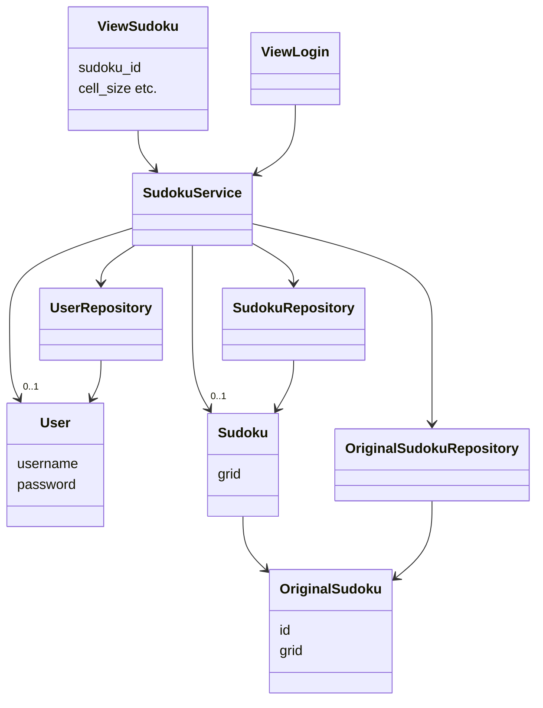
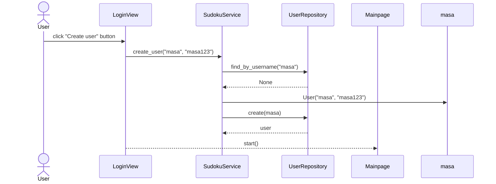

## Luokka-/pakkauskaavio sovelluksesta

Oheinen luokka-/pakkauskaavio kuvastaa sovelluksen luokkien suhdetta toisiinsa.

## Sekvenssikaavio uuden käyttäjän luomisesta

Kun uusi käyttäjä kirjautuu sovellukseen, kontrolli etenee seuraavasti:

