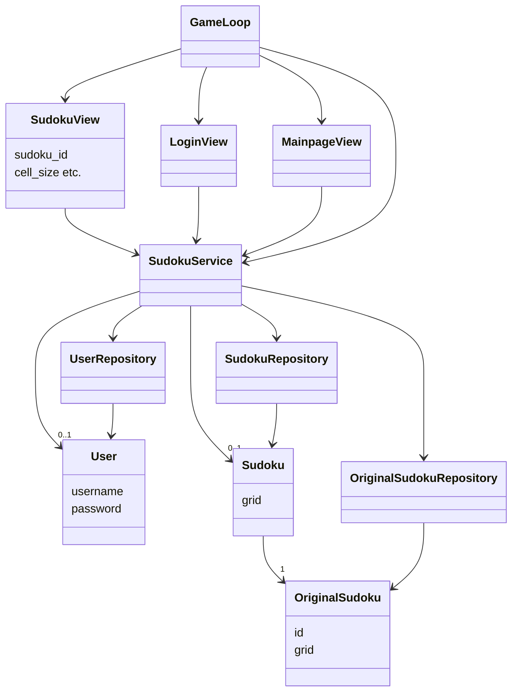
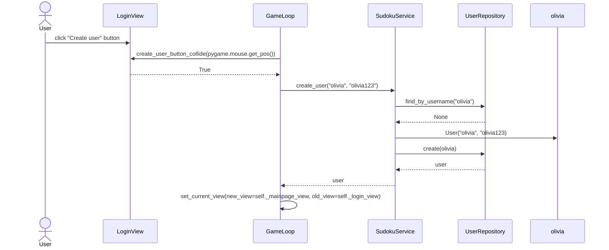
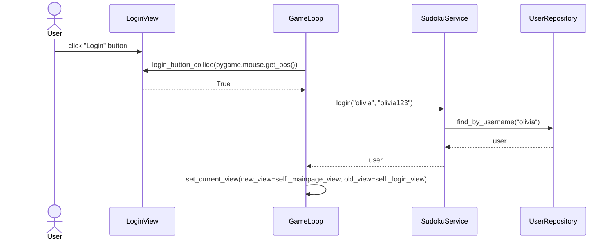
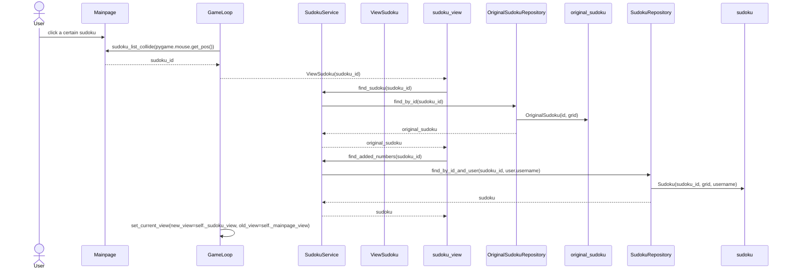
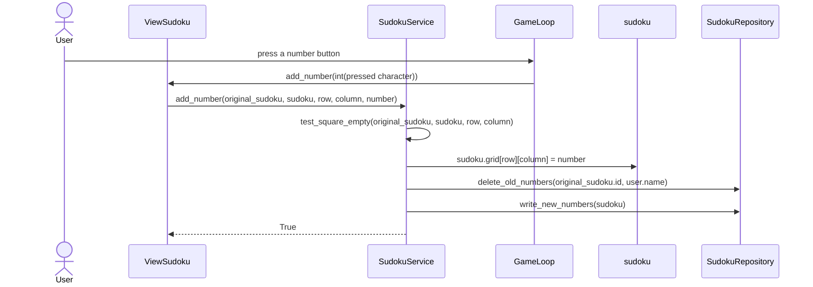

# Arkkitehtuurikuvaus

## Rakenne

Sovelluksen rakenne mukailee kurssin referenssisovelluksen [TodoApp](https://github.com/ohjelmistotekniikka-hy/python-todo-app) kolmitasoista kerrosarkkitehtuuria, ja sisältää seuraavat pakkaukset/kansiot.

- [**ui**](https://github.com/oliviahorjamo/OhTe-harjoitustyo-2022/tree/master/src/ui) sisältää käyttöliittymään liittyvän koodin
- [**services**](https://github.com/oliviahorjamo/OhTe-harjoitustyo-2022/tree/master/src/services) sisältää sovelluslogiikkaan liittyvät koodin
- [**repositories**](https://github.com/oliviahorjamo/OhTe-harjoitustyo-2022/tree/master/src/repositories) sisältää sovelluksen tarvitseman pysyväistallennukseen liittyvän koodin
- [**entities**](https://github.com/oliviahorjamo/OhTe-harjoitustyo-2022/tree/master/src/entities) sisältää sovelluksen tietokohteisiin liittyvän koodin


## Käyttöliittymä

Käyttöliittymän toteuttamisessa on käytetty Python pygame -kirjastoa. Kaikki käyttöliittymään liittyvä koodi löytyy ui -kansiosta.

Käyttöliittymä sisältää kolme erilaista näkymää:

- Kirjautuminen/uuden käyttäjän luominen
- Etusivu jossa lista sudokuista
- Sudokun pelinäkymä

Käyttäjän käyttöliittymässä antaman syötteen huomioimisesta ja näkymien vaihtamisesta huolehtii [GameLoop](https://github.com/oliviahorjamo/OhTe-harjoitustyo-2022/blob/master/src/ui/gameloop.py) -luokka. Näkymän päivittämisestä huolehtii [Renderer](https://github.com/oliviahorjamo/OhTe-harjoitustyo-2022/blob/master/src/ui/renderer.py) -luokka, jota GameLoop kutsuu joka kierroksella. GameLoop kutsuu seuraavia luokkia erillisten näkymien piirtämiseen:

Kirjautumisesta ja uuden käyttäjän luomisesta vastaavan näkymän piirtämisestä huolehtii [LoginView](https://github.com/oliviahorjamo/OhTe-harjoitustyo-2022/blob/master/src/ui/login_view.py) -luokka.
Etusivun piirtämisestä huolehtii [MainpageView](https://github.com/oliviahorjamo/OhTe-harjoitustyo-2022/blob/master/src/ui/mainpage_view.py) -luokka.
Sudokun pelinäkymän piirtämisestä huolehtii [SudokuView](https://github.com/oliviahorjamo/OhTe-harjoitustyo-2022/blob/master/src/ui/sudoku_view.py) -luokka.
Kaikki luokat on sijoitettu omiin ui -kansiosta löytyviin moduuleihinsa.

Kaikki edellä mainitut luokat käyttävät Sprite -olioita käyttöliittymän objektien esittämiseen. Näiden koodi löytyy [sprites](https://github.com/oliviahorjamo/OhTe-harjoitustyo-2022/blob/master/src/ui/sprites.py) -moduulista. 

Kaikki käyttöliittymän koodi huolehtii vain käyttöliittymän näyttämisestä ja käyttäjän syötteen huomioimisesta. Käyttöliittymä kutsuu sovelluslogiikasta vastaavan luokan [SudokuService](https://github.com/oliviahorjamo/OhTe-harjoitustyo-2022/blob/master/src/services/sudoku_service.py) metodeja.

## Sovelluslogiikka

Sovelluslogiikasta vastaa SudokuService -luokan ainoa olio. Luokka huolehtii sovelluslogiikasta käyttäjän käyttöliittymässä antaman syötteen mukaisesti.

Sovellus sisältää kolmenlaisia tietokohteita, jotka kaikki on toteutettu omina luokkinaan:
- [**User**](https://github.com/oliviahorjamo/OhTe-harjoitustyo-2022/blob/master/src/entities/user.py) -luokka kuvaa käyttäjään liittyviä tietoja.
- [**OriginalSudoku**](https://github.com/oliviahorjamo/OhTe-harjoitustyo-2022/blob/master/src/entities/sudoku.py#L1) -luokka kuvaa alkuperäisiä sovellukseen lisättyjä sudokuita, joita ei voi muokata.
- [**Sudoku**](https://github.com/oliviahorjamo/OhTe-harjoitustyo-2022/blob/master/src/entities/sudoku.py#L21) -luokka kuvaa käyttäjän henkilökohtaisia muokattuja sudokuita, jotka liittyvät aina tiettyyn OriginalSudoku -luokan olioon.


SudokuService käsittelee sudokuihin ja käyttäjiin liittyviä tietoja repositories -pakkauksessa sijaitsevien luokkien [OriginalSudokuRepository](https://github.com/oliviahorjamo/OhTe-harjoitustyo-2022/blob/master/src/repositories/sudoku_repository.py#L8), [SudokuRepository](https://github.com/oliviahorjamo/OhTe-harjoitustyo-2022/blob/master/src/repositories/sudoku_repository.py#L102) ja [UserRepository](https://github.com/oliviahorjamo/OhTe-harjoitustyo-2022/blob/master/src/repositories/user_repository.py) avulla.

## Tietojen pysyväistallennus

Pakkausen repositories luokat UserRepository, OriginalSudokuRepository ja SudokuRepository huolehtivat tietojen tallettamisesta pysyväismuistiin. UserRepository tallentaa tietoa SQLite -tietokantaan. Sudokuihin liittyvät repositoriot tallentavat tietoa csv -tiedoistoihin.

### Pysyväistallennukseen liittyvät tiedostot

Sovelluksen juureen sijoitettu [.env](https://github.com/oliviahorjamo/OhTe-harjoitustyo-2022/blob/master/.env) -konfiguraatiotiedosto määrittelee tiedostojen nimet, joihin tieto tallennetaan. Käyttäjä voi halutessaan muuttaa näitä nimiä.

Käyttäjät tallennetaan SQLite tietokannan tauluun users. Tietokanta alustetaan initialize_database.py moduulissa.

Alkuperäiset sudokut talletetaan csv -tiedostoon seuraavassa muodossa:

```
1;7, 8, 0, 4, 0, 0, 1, 2, 0;6, 0, 0, 0, 7, 5, 0, 0, 9;0, 0, 0, 6, 0, 1, 0, 7, 8;0, 0, 7, 0, 4, 0, 2, 6, 0;0, 0, 1, 0, 5, 0, 9, 3, 0;9, 0, 4, 0, 6, 0, 0, 0, 5;0, 7, 0, 3, 0, 0, 0, 1, 2;1, 2, 0, 0, 0, 7, 4, 0, 0;0, 4, 9, 2, 0, 6, 0, 0, 7
```
Ensimmäinen kenttä on kyseisen alkuperäisen sudokun id, jonka perusteella alkuperäiset numerot haetaan myöhemmin käyttäjän aloittaessa peliä. Seuraavat kentät sisältävät alkuperäiset numerot riveittäin eli kenttiä on yhteensä 9, joissa jokaisessa on 9 numeroa.

Käyttäjän muokkaamat sudokut talletetaan csv -tiedostoon seuraavassa muodossa:

```
1;olivia;0, 0, 0, 0, 0, 0, 0, 0, 0;0, 0, 4, 0, 0, 0, 0, 0, 0;0, 0, 0, 0, 0, 0, 0, 0, 0;0, 0, 0, 0, 0, 0, 0, 0, 0;0, 0, 0, 0, 0, 0, 0, 0, 0;0, 0, 0, 0, 0, 0, 0, 0, 0;0, 0, 0, 0, 0, 0, 0, 0, 0;0, 0, 0, 0, 0, 0, 0, 0, 0;0, 0, 0, 0, 0, 0, 0, 0, 0
```
Ensimmäinen kenttä on kyseiseen keskeneräiseen ratkaisuun liittyvät numerot. Seuraavissa kentissä on käyttäjän lisäämät numerot riveittäin. Jos käyttäjä ei ole lisännyt mitään numeroa, numeron kohdalla on 0 eli myös alkuperäisten numeroiden kohdalla on 0. Jos käyttäjä on lisännyt numeron, kyseisen numeron kohdalla on lisätty numero.


Seuraava esimerkki kuvaa sovelluslogiikkaa käyttäjän kirjautuessa sovellukseen:

## Luokkakaavio sovelluksesta

Oheinen kaavio kuvastaa yllä mainittujen sovelluksen luokkien suhdetta toisiinsa.


## Tärkeimmät toiminnallisuudet

### Uuden käyttäjän luominen

Kun uusi käyttäjä kirjautuu sovellukseen, kontrolli etenee seuraavasti:


GameLoop -luokka saa LoginView -luokalta tiedon, että käyttäjä on painanut uuden käyttäjän luomis -painiketta, minkä jälkeen GameLoop -luokka kutsuu `SudokuService` luokan metodia [create_user](https://github.com/oliviahorjamo/OhTe-harjoitustyo-2022/blob/master/src/services/sudoku_service.py#L53) ja antaa metodille parametreiksi käyttäjän käyttöliittymässä antaman käyttäjänimen ja salasanan. Tämän jälkeen SudokuService tarkistaa [UserRepository](https://github.com/oliviahorjamo/OhTe-harjoitustyo-2022/blob/master/src/repositories/user_repository.py) -luokalta, että kyseisellä nimellä ei ole vielä luotu käyttäjää. Tämän jälkeen SudokuService luo uuden User -olion, ja antaa UserRepository -luokalle käskyn tallentaa käyttäjä pysyväistallennukseen. Tämän jälkeen SudokuService palauttaa GameLoop luokalle luodun käyttäjän, minkä jälkeen GameLoop luokka vaihtaa käyttöliittymän näkymän etusivuun.

### Sisään kirjautuminen


GameLoop -luokka saa LoginView -luokalta tiedon, että käyttäjä on painanut sisäänkirjautumispainiketta, minkä jälkeen GameLoop -luokka kutsuu `SudokuService` luokan metodia [login](https://github.com/oliviahorjamo/OhTe-harjoitustyo-2022/blob/master/src/services/sudoku_service.py#L32) ja antaa metodille parametreiksi käyttäjän käyttöliittymässä antaman käyttäjänimen ja salasanan. Tämän jälkeen SudokuService tarkistaa UserRepository -luokalta, että kyseisellä nimellä ei ole vielä luotu käyttäjää. Tämän jälkeen SudokuService luo uuden User -olion, ja antaa UserRepository -luokalle käskyn tallentaa käyttäjä pysyväistallennukseen. Tämän jälkeen SudokuService palauttaa GameLoop luokalle luodun käyttäjän, minkä jälkeen GameLoop luokka vaihtaa käyttöliittymän näkymän etusivuun.

### Sudokun klikkaaminen listassa


GameLoop saa Mainpagelta tiedon, että käyttäjä on klikannut tiettyä sudokua. GameLoop luo uuden SudokuView() olion ja antaa sille parametriksi klikatun sudokun id-numeron. Luotu SudokuView() olio pyytää SudokuServicea etsimään kyseisellä sudokun id:lla löytyvät tiedot. SudokuService pyytää OriginalSudokuRepositorya palauttamaan kyseisellä id:lla olevat alkuperäiset numerot OriginalSudoku -luokan oliona. SudokuService palauttaa tämän arvon ViewSudoku -oliolle, joka asettaa sen itselleen attribuutiksi (jätetty pois kuvasta selkeyden vuoksi). Tämän jälkeen ViewSudoku kysyy SudokuServicelta käyttäjän mahdollisesti kyseiseen sudokuun tallentamaa keskeneräistä ratkaisua. SudokuService pyytää tätä SudokuReposirotylta. SudokuRepository palauttaa keskeneräisen ratkaisun tai default -sudokun Sudoku -oliona. SudokuService palauttaa tämän ViewSudokulle, joka asettaa myös käyttäjän sudokun itselleen attribuutiksi.

### Numeron lisääminen sudokuun

Käyttäjä painaa jotakin numeropainiketta, jolloin GameLoop lähettää ViewSudokulle tiedon, että painiketta on painettu. ViewSudoku pyytää SudokuServicea lisäämään numeron. Jos kyseinen ruutu on tyhjä, SudokuService lisää numeron kyseiseen sudokuun liittyvään Sudoku -olioon ja pyytää tämän jälkeen SudokuRepositorya poistamaan käyttäjän aiemmin tehtävään luoman ratkaisun ja kirjoittamaan tilalle uuden ratkaisun. Tämän jälkeen ViewSudoku luokassa vielä muokataan käyttöliittymään littyviä Sprite -olioita vastaamaan uutta tilaa. Tämä on yksinkertaisuuden vuoksi jätetty pois sekvenssikaaviosta.

### Muut toiminnallisuudet

Kaikki sovelluksen toiminnot toimivat jotakuinkin samalla tavalla. Käyttäjä klikkaa jotakin käyttöliittymässä ja GameLoop saa tästä tiedon joko suoraan tai kysymällä ViewSudoku, ViewLogin tai ViewMainpage -oliolta, onko käyttäjä klikannut jotain painiketta. Tämän jälkeen GameLoop kutsuu SudokuServicen metodia. Kontrollin palautuessa takaisin käyttöliittymään GameLoop päivittää mahdollisesti käyttäjälle näkyvää sivua.
