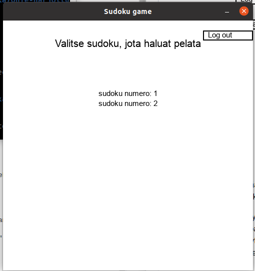

# Käyttöohje
Lataa projektin viimeisimmän [releasen](https://github.com/oliviahorjamo/OhTe-harjoitustyo-2022/releases) lähdekoodi 
valitsemalla Releases -osion _Assets_ -osion alta _Source code_.

## Konfigurointi
Sovelluksen käyttämien tiedostojen konfigurointitiedot löytyy päähakemiston _.env_ -tiedostosta, missä niitä voi halutessaan muokata.
Tiedostot luodaan automaattisesti data -hakemistoon, jos niitä ei ole vielä olemassa. Tiedoston muoto on seuraava:
```
SUDOKUS_FILENAME = sudokus.csv
ORIGINALS_FILENAME = originals.csv
DATABASE_FILENAME = database.sqlite
```

## Ohjelman käynnistäminen

Asenna sovelluksen käyttämät riippuvuudet ennen ohjelman käynnistämistä seuraavalla komennolla:
```bash
poetry install
```

Alusta seuraavaksi ohjelman käyttämä tietokanta seuraavalla komennolla:
```bash
poetry run invoke build
```

Ohjelman voi nyt suorittaa komennolla

```bash
poetry run invoke start
```

## Kirjautuminen ja uuden käyttäjän luominen

Sovellus käynnistyy ensimmäisenä kirjautumisnäkymään. 


Käyttäjätunnus -kenttää klikkaamalla voi kirjoittaa kenttään haluamansa käyttäjätunnuksen.
Vastaavasti Salasana -kenttää klikkaamalla voi kirjoittaa kenttään haluamansa salasanan.

Jos näillä tiedoilla löytyy jo käyttäjä, voit kirjautua sisään painamalla Log in -painiketta. Jos kyseessä on uusi käyttäjä,
luo käyttäjä painamalla Create user -painiketta. Jos olemassaolevan käyttäjän käyttäjänimi tai salasana on väärä, sovellus
näyttää virheviestin näytölle. Samoin sovellus antaa virheviestin, jos uutta käyttäjää luodessa kyseisellä käyttäjänimellä löytyy jo käyttäjä.

## Pelattavan sudokun valitseminen

Kun olet kirjautunut sisään, avautuu seuraavaksi etusivu, jossa on listattuna sovelluksesta löytyvät sudokut. 



Klikkaamalla sudokun
nimeä, saat avattua sudokun pelinäkymään.

## Sudokun pelaaminen


Sudokuun voi lisätä uusia numeroita siirtämällä ensin valintaruudun nuolinäppäimillä oikean ruudun päälle. Tämän jälkeen uuden numeron
voi lisätä painamalla haluamaansa numeronäppäintä. Jo lisätyn numeron voi poistaa painamalla Delete -näppäintä.  Alkuperäiset numerot on korostettu sinisellä ja niitä ei voi poistaa.

Sovellus tallentaa keskeneräisen ratkaisun jokaisen muutoksen jälkeen. Kun kirjaudut uudestaan sisään samalla tunnuksella,
sovellus hakee automaattisesti kyseiseen sudokuun liittyvät keskeneräisen ratkaisun. Esimerkiksi yllä olevassa kuvassa käyttäjä on lisännyt sudokuun numerot 2 ja 3 ensimmäiseen ruudukkoon, jolloin nämä numerot ovat valmiina sudokussa käyttäjän avatessa sen.

## Ulos kirjautuminen

Klikkaamalla näkymän _Log out_ -painiketta voi kirjautua sovelluksesta ulos, jolloin palaa takaisin kirjautumisnäkymään.
