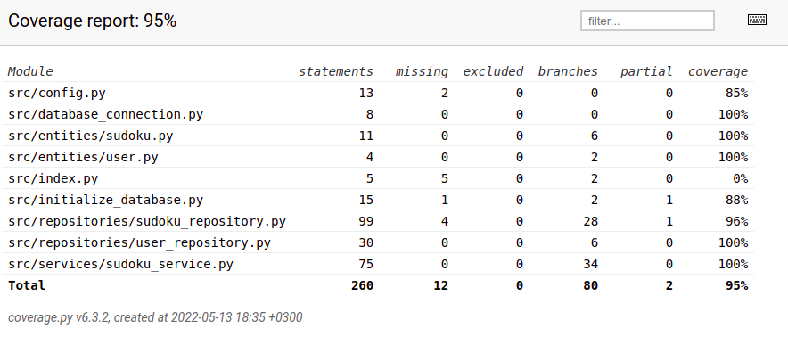

# Testausdokumunetti

Ohjelmaa on testattu automatisoidusti unittestillä sekä yksikkö- että integraatiotasolla. Lisäksi ohjelmaa on testattu manuaalisesti
järjestelmätasolla.

## Unittestit (yksikkö- ja integraatiotestaus)

### Sovelluslogiikka

Sovelluslogiikasta vastaavaa ´SudokuService´ -luokkaa testataan [TestSudokuService](https://github.com/oliviahorjamo/OhTe-harjoitustyo-2022/blob/master/src/tests/sudoku_service_test.py) -luokalla. `TestSudokuService` käyttää testaukseen erityisiä testitiedostoja/testitietokantaa, joiden konfigurointi löytyy [.env.test](https://github.com/oliviahorjamo/OhTe-harjoitustyo-2022/blob/master/.env.test) -tiedostosta. Tällöin testit eivät tallenna mitään sovelluksen oikeaan tietokantaan tai tiedostoihin.

Tiedoston sisältö näyttää seuraavanlaiselta:
```
SUDOKUS_FILENAME = test_sudokus.csv
ORIGINALS_FILENAME = test_originals.csv
DATABASE_FILENAME = test_database.sqlite
```

### Repositorio -luokat

Repositorio -luokkia `UserRepository`, `OriginalSudokuRepository` ja `SudokuRepository` testataan samoilla testitiedoistoilla. Näitä testataan [TestUserRepository](https://github.com/oliviahorjamo/OhTe-harjoitustyo-2022/blob/master/src/tests/user_repository_test.py), [TestOriginalSudokuRepository](https://github.com/oliviahorjamo/OhTe-harjoitustyo-2022/blob/master/src/tests/sudoku_repository_test.py) ja [TestSudokuRepository](https://github.com/oliviahorjamo/OhTe-harjoitustyo-2022/blob/master/src/tests/sudoku_repository_test.py) luokilla.
Suurin osa repositorioiden toiminnasta testataan TestSudokuService -luokassa integraatiotestein.

### Testauskattavuus

Sovelluksen testauksen haarautumakattavuus on 95%. Käyttöliittymäkerros on jätetty testauksen ulkopuolelle.



Testaamatta jäivät _build.py_- ja _initialize\_database.py_-tiedostojen suorittaminen komentoriviltä. Lisäksi testaamatta jäi tilanne, jossa kirjoitettaisiin uusia sudokuita sudokus.csv -tiedostoon kontrolloimatta lainkaan sitä, että aiempia sudokuita ei poisteta. Tätä toiminnallisuutta ei käytetä sovelluksessa missään ja sitä kutsutaan testauksessa vain tyhjällä sudoku -listalla, jolloin koko csv -tiedosto tyhjennetään. Lisäksi testaamatta jäivät tilanteet, joissa repositorioiden tarvitsemia tiedostoja ei ole valmina.

## Järjestelmätestaus

Sovelluksen järjestelmätestaus on suoritettu manuaalisesti.

### Asennus

Sovellus on haettu sitä on testattu [käyttöohjeen](./kayttoohje.md) kuvaamalla tavalla Linux -ympäristössä. Testauksessa ei ole muutettu sovelluksen konfiguraatioita eikä sovellusta ole testattu tilanteessa, jossa pysyväistallennukseen tarvittavia tiedostoja ei ole ollut valmiiksi olemassa.

### Toiminnallisuudet

Kaikki [määrittelydokumentin](./vaatimusmmarittely.md) listaamat valmiiksi tulleet ominaisuudet on käyty läpi ja niitä on pyritty testaamaan myös virheellisillä arvoilla kuten tyhjillä arvoilla, liian pitkillä arvoilla tai merkkijonoilla silloin kun sovellus pyytää numeroarvoja.

## Sovellukseen jääneet laatuongelmat

Sovellus ei anna järkeviä virheilmoituksia seuraavissa tilanteissa:

- Konfiguraation määrittelemiin tiedostoihin ei ole luku/kirjoitusoikeuksia
- SQLite tietokantaa ei ole alustettu, eli `python -m poetry run invoke build`-komentoa ei ole suoritettu

Lisäksi ei testata laisinkaan, ovatko käyttäjän antamat numerot sudokussa virheellisiä. Tämän tarkoituksena on mukailla perinteistä sudokua, jossa käyttäjä huomaa virheen itse usein tehtyään sudokua virheellisesti tarpeeksi kauan.

