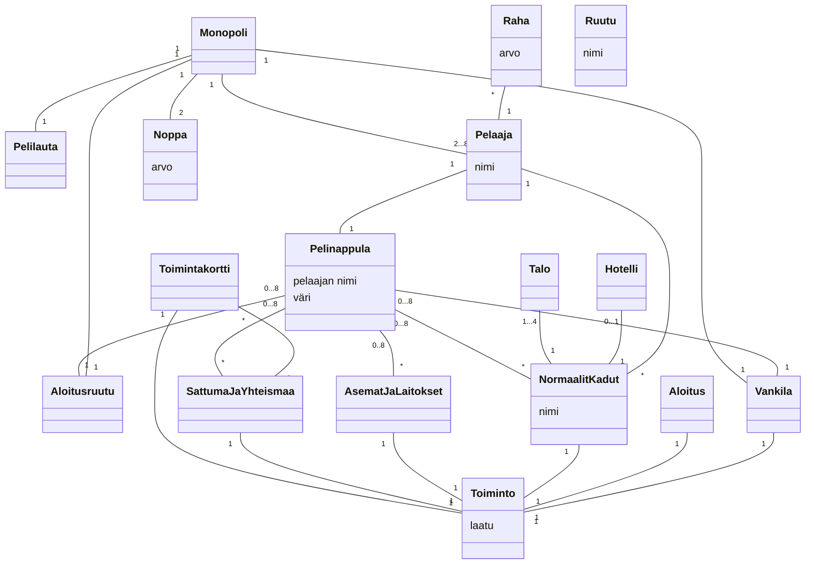

Tehtävä 1: Monopoli -pelin luokkakaavio

- 2 noppaa
- pelaajia 2-8
- pelilauta
- pelilaudassa 40 ruutua
- ruutu tietää mikä on seuraava ruutu pelilaudalla
- yksi pelinappula per pelaaja
- pelinappula on aina yhdessä ruudussa

