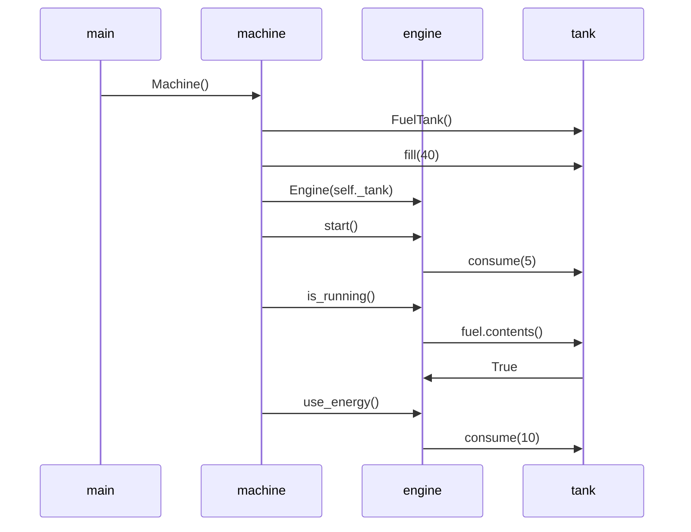

```mermaid
sequenceDiagram
  participant main
  participant machine
  participant engine
  participant tank
  main->>machine: Machine()
  machine->>tank: FuelTank()
  machine->>tank: fill(40)
  machine->>engine: Engine(self._tank)
  machine->>engine: start()
  engine->>tank: consume(5)
  machine->>engine: is_running()
  engine->>tank: fuel.contents()
  tank->>engine: True
  machine->>engine: use_energy()
  engine->>tank: consume(10)
```
